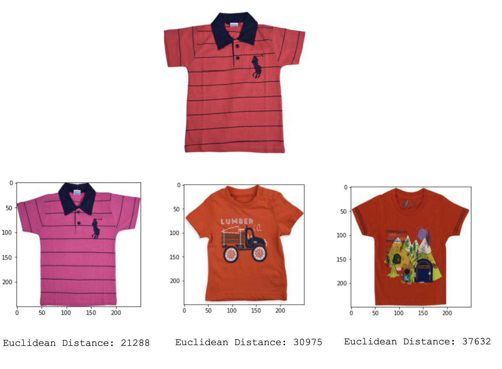
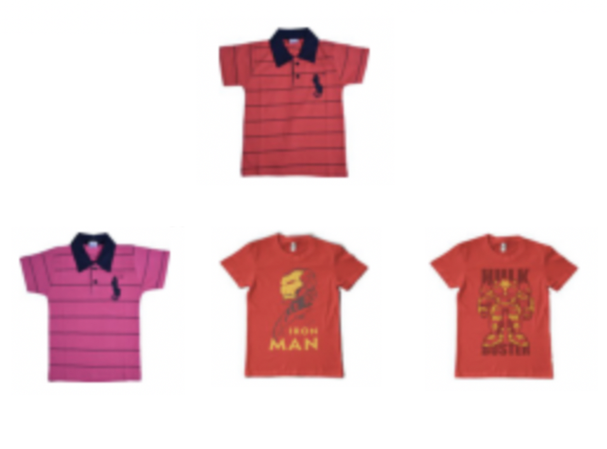

# Querying Similar Images with TensorFlow

Compare two different image search engine approaches developed with Deep Learning. You can found a more comprehensive explanation in this [Medium]() post.

## Requirements
- pandas
- numpy
- tqdm
- requests
- tensorflow==2.3.1
- pillow
- matplotlib

## Motivation

We are going to solve this problem using the [Flipkart](https://www.kaggle.com/PromptCloudHQ/flipkart-products) images dataset.

On one side, we train an Autoencoder to compress the image in a smaller dimension, so then we can compute the euclidean distance between the Auutoenconder's Latent Space and any desired picture to find similar ones on FLipkart image dataset. 

The output of the Autoencoder is the reconstruction of the iniput we feed the algorithm. This type of model consists of three main parts: Encoder, Latente Space, and Decoder. We are interested on the Latent Space of the model, given taht we can understand this output as a comnpressed represemntation of the initial image.

On the other hand, we extract the images features using a pretrained VGG16 on the imagenet dataset, and also calculate the euclidean distance between the images and any desired picture to find the similar ones.

Here we are interested on the output of the fully connected layer, where we can find all the imnage features.

## Results

As we can see, both architectures are quite different, anyway we arrive to similar results.

Let's take a look to the top 3 most similar images of the Polo shirt, using the Autoencoder:

Now, if we use the Image Features Extraction approach, we get the following top 3 similar images, for the same Polo shirt:

